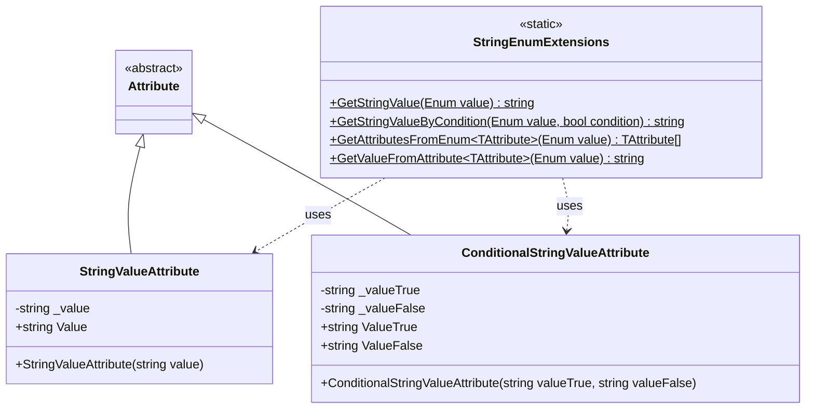
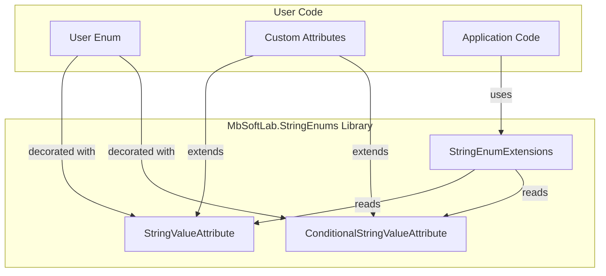
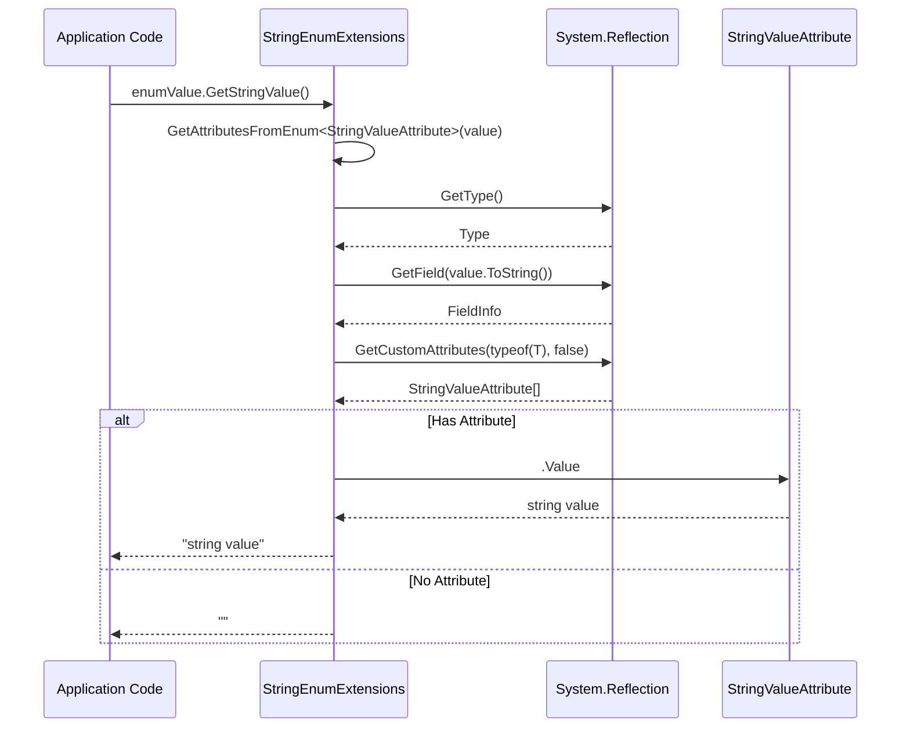
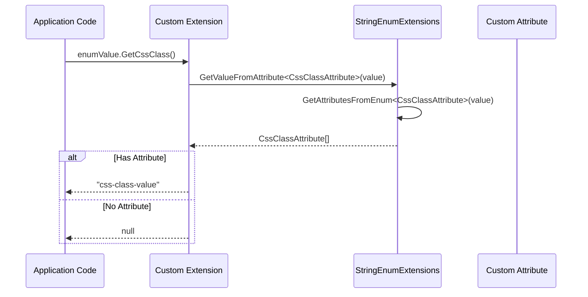
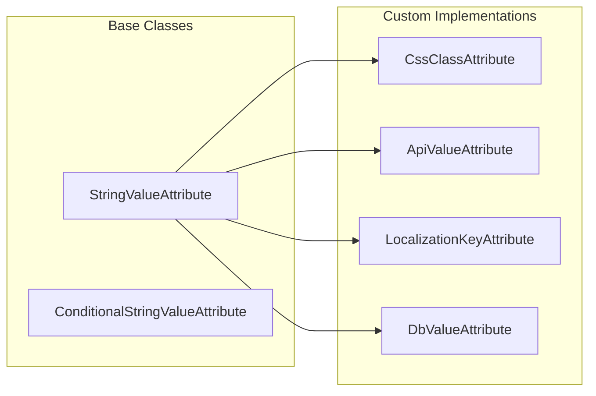
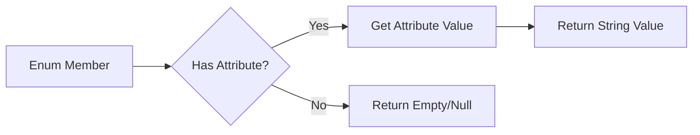

# Architecture Overview

> **Commit Reference:** `05e796ffe1bfb23188eed5ccb7b5222709f0455f` (v0.0.1)

This document describes the architecture and design of the MbSoftLab.StringEnums library.

## Project Structure

```
MbSoftLab.StringEnums/
├── MbSoftLab.StringEnums/           # Main library
│   ├── StringValueAttribute.cs      # Base attribute for string values
│   ├── ConditionalStringValueAttribute.cs  # Conditional attribute
│   ├── EnumExtensions.cs            # Extension methods
│   └── MbSoftLab.StringEnums.csproj # Project file
├── MbSoftLab.StringEnums.Demo/      # Demo application
│   ├── Program.cs                   # Example usage
│   └── MbSoftLab.StringEnums.Demo.csproj
├── MbSoftLab.StringEnums.Test/      # Unit tests
│   ├── EnumExtensionsUnitTest.cs    # Test cases
│   ├── DummyData/                   # Test data
│   └── MbSoftLab.StringEnums.Test.csproj
└── MbSoftLab.StringEnums.sln        # Solution file
```

## Class Diagram



## Component Overview



## How It Works

### Sequence Diagram: GetStringValue



### Sequence Diagram: Custom Attribute



## Extensibility Model



## Design Principles

### 1. Simplicity
The library follows the principle of doing one thing well: associating string values with enum members.

### 2. Extensibility
By providing a base `StringValueAttribute` class, users can easily create their own domain-specific attributes.

### 3. Non-Invasive
The library uses extension methods, which means no changes are required to existing enum types.

### 4. Lightweight
- No external dependencies
- Targets .NET Standard 2.0 for maximum compatibility
- Small binary footprint

### 5. Type Safety
Uses generics to ensure type safety when working with custom attributes.

## Data Flow



## Dependencies

The library has minimal dependencies:

| Dependency | Purpose |
|------------|---------|
| System | Core functionality |
| System.Reflection | Reading attributes from enum members |

## Build Configuration

| Property | Value |
|----------|-------|
| Target Framework | netstandard2.0 |
| Version | 0.0.1 |
| License | MIT |
| Package Generation | On Build |

## See Also

- [Quick Start Guide](../quickstart.md)
- [API Reference](../api-reference.md)
- [Advanced Usage](../advanced-usage.md)
